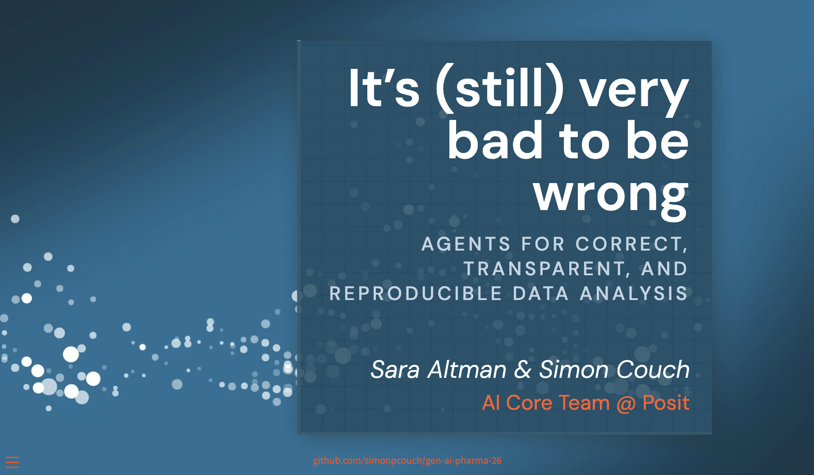

# It's (still) very bad to be wrong

Source code and slides for "It's (still) very bad to be wrong: Agents for Correct, Transparent, and Reproducible Data Analysis," from Sara Altman and Simon Couch of the AI Core Team at Posit. The rendered slides are [here](https://simonpcouch.github.io/gen-ai-pharma-26).

Some resources noted in the talk:

* [bluffbench](https://simonpcouch.github.io/bluffbench/), an eval measuring whether models will go along with a misleading description of a plot rather than report what they actually see.
* [Posit Assistant](http://pos.it/assistant), a data science coding agent in RStudio and Positron, and the case study for the talk's three design choices: the harness, code as the foundation, and the shape of the interaction.

If you're interested in keeping up with AI news from Posit, we maintain a fortnightly [AI Newsletter](https://opensource.posit.co/tags/ai-newsletter/) on the Posit Open Source Blog.

You can find us here:

|             | Sara Altman                                          | Simon Couch                                               |
|-------------|------------------------------------------------------|-----------------------------------------------------------|
| Website     | [saraaltman.com](https://saraaltman.com/)            | [simonpcouch.com](https://www.simonpcouch.com/blog/)      |
| GitHub      | [skaltman](https://github.com/skaltman)              | [simonpcouch](https://github.com/simonpcouch)             |
| LinkedIn    | [sarakaltman](https://www.linkedin.com/in/sarakaltman/) | [simonpcouch](https://www.linkedin.com/in/simonpcouch/) |
| BlueSky     | [sara-altman](https://bsky.app/profile/sara-altman.bsky.social) | [simonpcouch.com](https://bsky.app/profile/simonpcouch.com) |
