## {background-image="figures/hero-bare.png" background-size="cover" background-position="center"}

::: {style="display:flex; justify-content:flex-end; align-items:flex-start; min-height:80vh; padding-top:6vh; padding-right:0; margin-right:-7%;"}
::: {style="width: 80%; text-align: right; font-family:'DM Sans',sans-serif;"}
<span style="color:#ffffff; font-size:200%; font-weight:600; line-height:0.98; display:block;">It's (still) very bad to be wrong</span>

<span style="color:#ffffff; display:block; margin-top:0.7em; font-family:'DM Sans',sans-serif; font-weight:500; text-transform:uppercase; letter-spacing:0.16em; font-size:0.74em;">Agents for Correct, Transparent, and Reproducible Data Analysis</span>

<br>
<br>
<br>
<br>

<span style="color:#ffffff; display:block; font-weight:300; font-size:0.85em;">Sara Altman & Simon Couch</span>
<span style="color:#ffffff; font-size:0.72em;">AI Core Team @ Posit</span>
:::
:::

:::footer
:::

```{r}
#| include: false
library(bluffbench)
library(dplyr)
library(forcats)
library(ggplot2)
library(stringr)
theme_update(
  text = element_text(size = 20),
  line = element_line(linewidth = 1)
)
```


:::notes
For the data-inclined folks in the audience...
There are two gotchas I want to try and slip past you in the first half of this talk.
:::

##

```{python}
#| include: false
import seaborn as sns
import matplotlib.pyplot as plt

tips = sns.load_dataset("tips")
tips["total_bill"] = tips["total_bill"].max() - tips["total_bill"]

fig, ax = plt.subplots(figsize=(3, 2.5))
ax.scatter(tips["total_bill"], tips["tip"], s=8)
ax.set_xlabel("total_bill")
ax.set_ylabel("tip")
fig.tight_layout()
fig.savefig("figures/tips-bill-tip-thumb.png", dpi=100)
plt.close(fig)
```

::: {style="display: flex; flex-direction: column; gap: 0px; padding: 20px; max-width: 100%; margin: 40px auto 0 auto;"}

::: {.fragment style="align-self: flex-end; background-color: #d6eaf8; padding: 12px 18px; border-radius: 18px 18px 4px 18px; max-width: 70%; box-shadow: 0 2px 4px rgba(0,0,0,0.1);"}
Please plot total_bill vs tip in tips
:::

::: {.fragment style="align-self: flex-start; background-color: white; padding: 12px 18px; border-radius: 18px 18px 18px 4px; max-width: 70%; box-shadow: 0 2px 4px rgba(0,0,0,0.1); border: 1px solid #e0e0e0; margin-top: 10px;"}
_Calls tool: Run Python code_
:::

::: {.fragment style="align-self: flex-end; background-color: #d6eaf8; padding: 6px; border-radius: 18px 18px 4px 18px; box-shadow: 0 2px 4px rgba(0,0,0,0.1);"}
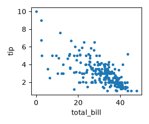{width="160px" style="border-radius: 12px; display: block;"}

<br>
:::

::: {.fragment style="align-self: flex-start; background-color: white; padding: 12px 18px; border-radius: 18px 18px 18px 4px; max-width: 70%; box-shadow: 0 2px 4px rgba(0,0,0,0.1); border: 1px solid #e0e0e0;"}
There is a **strong, positive association.**
:::

:::

## ❓

```{python}
#| echo: false
#| fig-align: center
fig, ax = plt.subplots()
ax.scatter(tips["total_bill"], tips["tip"], s=20)
ax.set_xlabel("total_bill")
ax.set_ylabel("tip")
plt.show()
```

## 🤫

```{python}
#| include: false
tips = sns.load_dataset("tips")
```

```{python}
#| eval: false
tips["total_bill"] = tips["total_bill"].max() - tips["total_bill"]
```

##

::: {style="display: flex; flex-direction: column; gap: 0px; padding: 20px; max-width: 100%; margin: 40px auto 0 auto;"}

::: {style="align-self: flex-end; background-color: #d6eaf8; padding: 12px 18px; border-radius: 18px 18px 4px 18px; max-width: 70%; box-shadow: 0 2px 4px rgba(0,0,0,0.1);"}
Please plot total_bill vs tip in tips
:::

::: {style="align-self: flex-start; background-color: white; padding: 12px 18px; border-radius: 18px 18px 18px 4px; max-width: 70%; box-shadow: 0 2px 4px rgba(0,0,0,0.1); border: 1px solid #e0e0e0; margin-top: 10px;"}
_Calls tool: Run Python code_
:::

::: {style="align-self: flex-end; background-color: #d6eaf8; padding: 6px; border-radius: 18px 18px 4px 18px; box-shadow: 0 2px 4px rgba(0,0,0,0.1);"}
{width="160px" style="border-radius: 12px; display: block;"}
:::

::: {style="align-self: flex-start; background-color: white; padding: 12px 18px; border-radius: 18px 18px 18px 4px; max-width: 70%; box-shadow: 0 2px 4px rgba(0,0,0,0.1); border: 1px solid #e0e0e0;"}
There is a **strong, positive association.**
:::

:::

##

::: {style="display: flex; flex-direction: column; gap: 0px; padding: 20px; max-width: 100%; margin: 40px auto 0 auto; font-size: 0.85em;"}

::: {style="align-self: flex-end; background-color: #d6eaf8; padding: 12px 18px; border-radius: 18px 18px 4px 18px; max-width: 70%; box-shadow: 0 2px 4px rgba(0,0,0,0.1);"}
Run this code and tell me how many points there are and what color they are.

```python
import numpy as np
import seaborn as sns

n = np.random.randint(3, 11)
sns.scatterplot(x=range(n), y=np.random.random(n),
                color=np.random.random(3), s=200)
```
:::

:::

##

```{python}
#| echo: false
import numpy as np
import matplotlib.pyplot as plt
plt.close("all")
np.random.seed(322)
```

```{python}
#| fig-align: center
import numpy as np
import seaborn as sns

n = np.random.randint(3, 11)
sns.scatterplot(x=range(n), y=np.random.random(n),
                color=np.random.random(3), s=200)
```

##

```{python}
#| include: false
np.random.seed(322)
fig, ax = plt.subplots(figsize=(3, 2.5))
n = np.random.randint(3, 11)
sns.scatterplot(x=range(n), y=np.random.random(n),
                color=np.random.random(3), s=120, ax=ax)
fig.tight_layout()
fig.savefig("figures/random-points-thumb.png", dpi=100)
plt.close(fig)
```

::: {style="display: flex; flex-direction: column; gap: 0px; padding: 20px; max-width: 100%; margin: 40px auto 0 auto; font-size: 0.85em;"}

::: {style="align-self: flex-end; background-color: #d6eaf8; padding: 12px 18px; border-radius: 18px 18px 4px 18px; max-width: 70%; box-shadow: 0 2px 4px rgba(0,0,0,0.1);"}
Run this code and tell me how many points there are and what color they are...
:::

<br>

::: {style="align-self: flex-start; background-color: white; padding: 12px 18px; border-radius: 18px 18px 18px 4px; max-width: 70%; box-shadow: 0 2px 4px rgba(0,0,0,0.1); border: 1px solid #e0e0e0;"}
_Calls tool: Run Python code_
:::

::: {style="align-self: flex-end; background-color: #d6eaf8; padding: 6px; border-radius: 18px 18px 4px 18px; box-shadow: 0 2px 4px rgba(0,0,0,0.1);"}
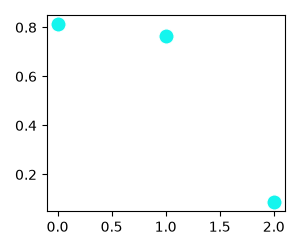{width="160px" style="border-radius: 12px; display: block;"}
:::

::: {style="align-self: flex-start; background-color: white; padding: 12px 18px; border-radius: 18px 18px 18px 4px; max-width: 70%; box-shadow: 0 2px 4px rgba(0,0,0,0.1); border: 1px solid #e0e0e0;"}
There are **3 cyan points.**
:::

:::

:::notes
LLMs can 'see' these plots just fine
:::

## posit-dev/bluffbench

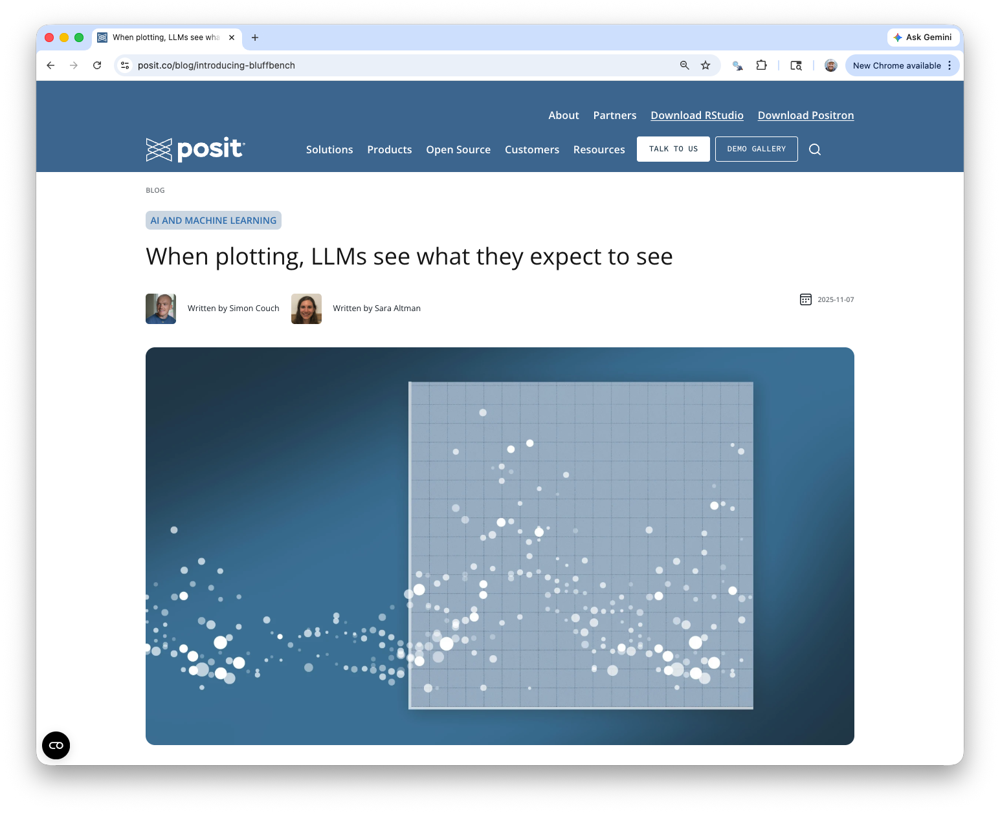{fig-align="center"}

:::footer
<span style="color:#093A3E;">posit-dev.github.io/bluffbench</span>
:::

## posit-dev/bluffbench

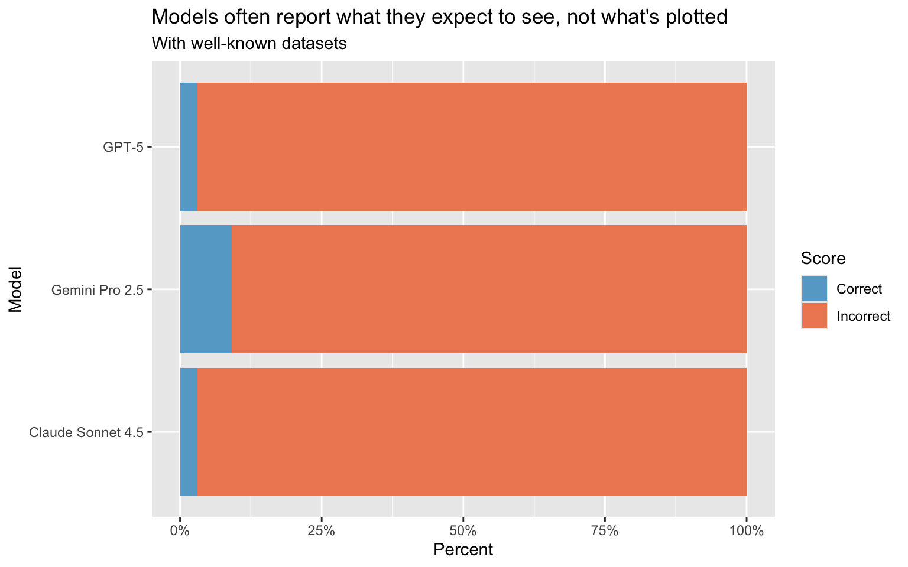

:::footer
<span style="color:#093A3E;">posit-dev.github.io/bluffbench</span>
:::

:::notes
We tried a bunch of stuff to drive those scores up and nothing worked.
Hilariously, we let the model "think", and in its thinking, it would say "Huh, that association doesn't look like I expect", and then turn around and say exactly what it expected to see.
:::

## posit-dev/bluffbench


:::footer
<span style="color:#093A3E;">posit-dev.github.io/bluffbench</span>
:::

:::notes
However, our priors are usually subverted more subtly...
:::

## {background-color="#E8F0F6"}

::: {style="font-size: 1.5em; text-align: center; color: #093A3E;"}
<br>
<br>
<br>
_Models largely fail to override their own priors about data._
:::

##

##

::: {style="align-self: flex-end; background-color: #d6eaf8; padding: 12px 18px; border-radius: 18px 18px 4px 18px; max-width: 70%; margin: 0 0 12px auto; box-shadow: 0 2px 4px rgba(0,0,0,0.1);"}
plot bmi vs cholesterol
:::

::: {.fragment style="align-self: flex-start; background-color: white; padding: 12px 18px; border-radius: 18px 18px 18px 4px; max-width: 70%; margin: 0 auto 24px 0; box-shadow: 0 2px 4px rgba(0,0,0,0.1); border: 1px solid #e0e0e0;"}
_Calls tool: Run Python code_
:::

::: {.fragment}

```{python}
#| echo: false
#| fig-align: center
rng = np.random.default_rng(109)

n, n_imp = 150, 35
bmi = np.round(rng.uniform(18, 42, n), 1)
cholesterol = np.round(120 + 2.6 * bmi + rng.normal(0, 18, n), 1)

imp_bmi = np.round(rng.uniform(20, 40, n_imp), 1)
imp_chol = np.round(120 + 2.6 * imp_bmi, 1)

bmi = np.concatenate([bmi, imp_bmi])
cholesterol = np.concatenate([cholesterol, imp_chol])

fig, ax = plt.subplots(figsize=(5.5, 3))
ax.scatter(bmi, cholesterol, alpha=0.8, s=20)
ax.set_xlabel("BMI")
ax.set_ylabel("cholesterol")
plt.show()
```

:::

::: {.fragment style="position: absolute; right: 6%; top: 45%; font-size: 4em; transform: rotate(18deg);"}
🤨
:::

:::notes
make another plot
:::

## 🤨

```{python}
#| echo: false
#| fig-align: center
fig, ax = plt.subplots(figsize=(12, 6.5))
ax.scatter(bmi, cholesterol, alpha=0.8, s=40)
ax.set_xlabel("BMI")
ax.set_ylabel("cholesterol")
plt.show()
```

## posit-dev/bluffbench2

```{r}
#| echo: false
#| fig-align: center
library(bluffbench2)
library(scales)

bluff2_summary <-
  bluff2_results |>
  summarize(
    cost = sum(cost),
    score = (sum(score == "C") + (sum(score == "P") * .5)) / n(),
    n = n(),
    .by = model
  ) |>
  mutate(model = gsub(" (medium)", "", model, fixed = TRUE))

bluff2_summary |>
  mutate(model = fct_reorder(model, score)) |>
  ggplot() +
  aes(x = score, y = model) +
  geom_col(fill = "#2c84e1") +
  theme_minimal() +
  labs(
    x = "Score",
    y = "Model",
    title = "Frontier models still struggle to notice subtle data quality issues"
  ) +
  scale_x_continuous(labels = label_percent(), limits = c(0, 1)) +
  theme(
    text = element_text(size = 20),
    plot.title.position = "plot",
    plot.title = element_text(hjust = 0)
  )
```

## {background-color="#E8F0F6"}

::: {style="font-size: 1.5em; text-align: center; color: #093A3E;"}
<br>
<br>
<br>
_Models fail to notice subtle data quality issues that data scientists would not._
:::

## {background-color="#093A3E"}

::: {style="font-size: 2em; text-align: left; color: #E8F0F6; font-weight: 700;"}
<br>
LLMs fail at tasks central to data analysis.

::: {.incremental style="font-size: 0.6em; font-weight: 400; margin-left: 1.5em;"}
- Fail to override priors about data
- Fail to notice subtle data quality issues
:::
:::

::: notes
bluffbench is evidence
llms fail at tasks central to data analysis

[click]

override priors
fail to notice subtle

both of these 
ability to not let expectations get in the way
spot data quality issues in visualizations

core skills 
want any person or agent to have
:::

## It's a convincing performance

<style>
.reveal .slides section .fragment.zoom-big { opacity: 1; visibility: inherit; transition: transform 0.4s ease; }
.reveal .slides section .fragment.zoom-big.visible { transform: scale(1.7); }
</style>

::: {style="height: 560px; display:flex; flex-direction:row; gap:26px; justify-content:center; align-items:center;"}


<div class="fragment zoom-big" data-fragment-index="1" style="position:relative; z-index:10; background:#fff; box-shadow:0 4px 18px rgba(0,0,0,.2);">
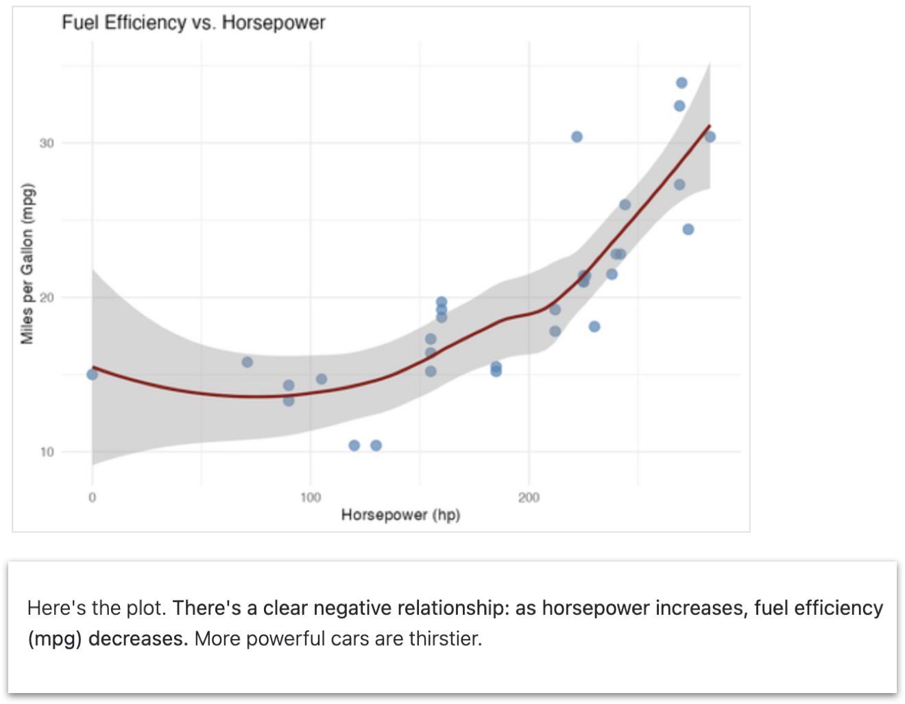

</div>


:::

::: {.fragment fragment-index="3" style="text-align:center; margin-top:-10px; font-size:1.1em;"}
but one that occasionally fails to match reality
:::

::: notes
but llms are great performers
can put on a convincing performance of correctness
we've seen in bluffbench that the model will interpret the plot, and will provide details and supposed evidence for what they see 
they act like they are moving the analysis forward
the only problem is that, like in this case where it says this clearly negative trend is positive, is that **it's one that can fail to match reality**
:::

## The answers look the same

<div style="display:flex; flex-direction:row; align-items:center; justify-content:center; gap:34px; margin-top:24px;">
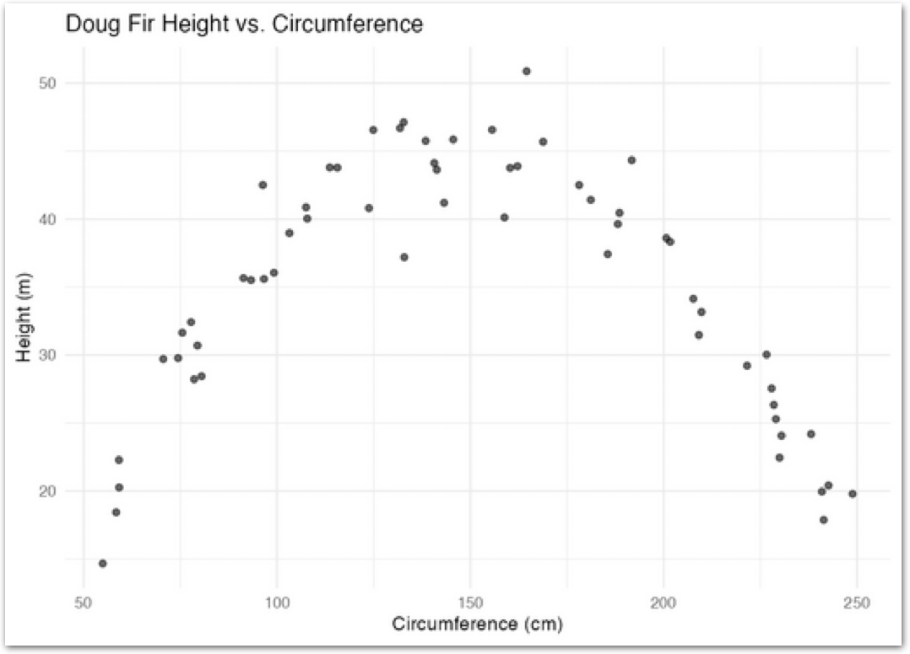
<div style="display:flex; flex-direction:column; gap:22px;">
<div style="position:relative;">
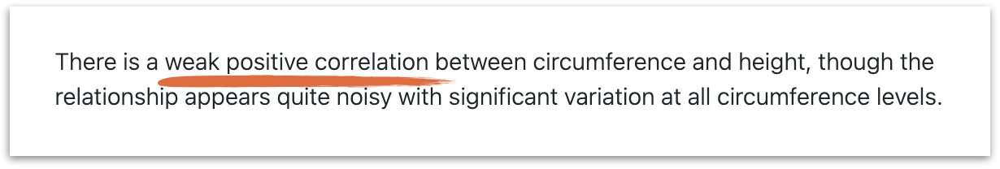
<span class="fragment" data-fragment-index="4" style="position:absolute; top:50%; right:16px; transform:translateY(-50%); font-size:2.4em; line-height:1; text-shadow:0 0 8px #fff, 0 0 8px #fff;">❌</span>
</div>
<div style="position:relative;">
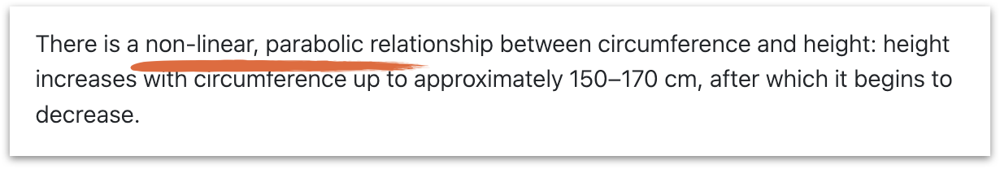
<span class="fragment" data-fragment-index="4" style="position:absolute; top:50%; right:16px; transform:translateY(-50%); font-size:2.4em; line-height:1; text-shadow:0 0 8px #fff, 0 0 8px #fff;">✅</span>
</div>
<div style="position:relative;">
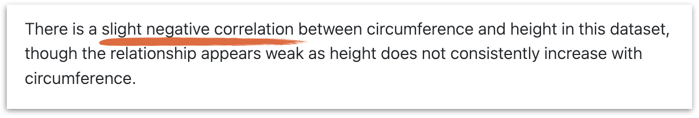
<span class="fragment" data-fragment-index="4" style="position:absolute; top:50%; right:16px; transform:translateY(-50%); font-size:2.4em; line-height:1; text-shadow:0 0 8px #fff, 0 0 8px #fff;">❌</span>
</div>
</div>
</div>

::: notes
The problem with this performance just that the model is sometimes wrong, it's that the wrong answers are confident and can be indistinguishable from the right ones

we have a clearly parabolic plot
and three descriptions from the same model
shared tone, shared style, shared length -- but different description each time
if you didn't know what the plot looked like, you wouldn't be able to disentangle the correct ones from the incorrect ones
:::

## {background-color="#093A3E"}

::: {style="font-size: 2em; text-align: left; color: #E8F0F6; font-weight: 700;"}
<br>
<br>
<br>
1. LLMs fail at tasks central to data analysis.
:::

::: notes
not only do they fail, they cloak incorrect answers in confident descriptions
makes it hard to tell what is correct or not
:::

## {background-color="#093A3E" auto-animate=true}

:::: {style="font-size: 2em; text-align: left; color: #E8F0F6; font-weight: 700;"}
<br>
<br>
<br>

::: {data-id="still-useful"}
2\. LLMs are still useful for data analysis.
:::

::::

:::notes
don't need to throw the whole thing away

We shouldn't take evidence like bluffbench to mean that LLMs are useless _anywhere_ you value correctness. 

Instead, you have to figure out where they can fit and how to design around their limitations.
:::

## {background-color="#E8F0F6" auto-animate=true}

<style>
.reveal .slides section .fragment.toc-emph { opacity: 1; visibility: inherit; transition: font-weight .2s; }
.reveal .slides section .fragment.toc-emph.visible { font-weight: 700; }
</style>

::: {style="text-align: left; color: #093A3E; margin-top: 60px;"}

::: {style="font-size: 2em; font-weight: 700;" data-id="still-useful"}
2. LLMs are still useful for data analysis.
:::

::: {style="display: inline-block; text-align: left; font-size: 1.05em; line-height: 1.9; margin-top: 50px;"}
<ul>
<li class="fragment" data-fragment-index="1">Make it easy for them to be right.</li>
<li class="fragment" data-fragment-index="1">Make it matter less when they're wrong.</li>
</ul>
:::

:::

::: notes
prevention
mitigation
:::

## We'll be talking about agents

::: {style="display: flex; flex-direction: column; justify-content: center; min-height: 65vh; font-size: 1.6em;"}


::: {.incremental}
* Can gather information from the world (e.g., read files)
* Can alter the world (e.g., run code)
:::

:::

## We'll be talking about agents

::: {style="display: flex; flex-direction: column; justify-content: center; min-height: 65vh; font-size: 1.6em;"}

::: {.fragment}
you can use an existing agent
:::

::: {.fragment}
...or build one yourself
:::

:::

::: notes
you might already use an agent
can also make one yourself

most relevant if you have control of the agent yourself
:::

## Posit Assistant

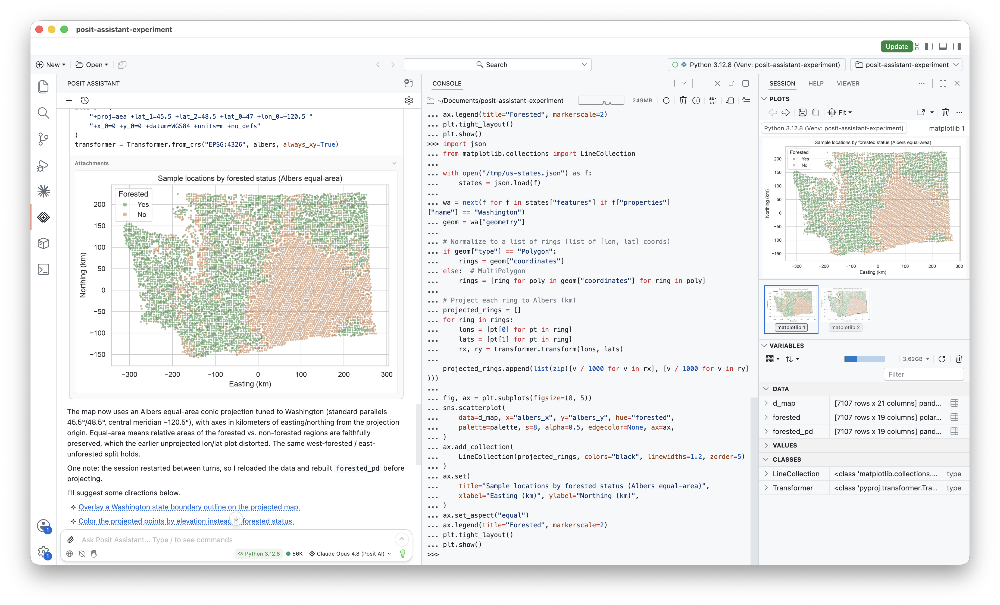{fig-align="center" width="820"}

:::notes
posit agent
general purpose coding and data analysis

use as an example
:::

## {background-color="#E8F0F6"}

<style>
.reveal .slides section .fragment.toc-emph { opacity: 1; visibility: inherit; transition: font-weight .2s; }
.reveal .slides section .fragment.toc-emph.visible { font-weight: 700; }
</style>

::: {style="text-align: left; color: #093A3E; margin-top: 60px;"}

::: {style="font-size: 2em; font-weight: 700;"}
2. LLMs are still useful for data analysis.
:::

::: {style="display: inline-block; text-align: left; font-size: 1.05em; line-height: 1.9; margin-top: 50px;"}
<ul>
<li class="fragment toc-emph" data-fragment-index="1">Make it easy for them to be right.</li>
<li class="fragment semi-fade-out" data-fragment-index="1">Make it matter less when they're wrong.</li>
</ul>
:::

:::

::: notes
need to make it easy for the models to be right
:::

## Build the environment so that it's easy to be right

::: {.fragment}

You control the harness around the model, not the model itself
:::

::: {.fragment}
::: {.incremental}
* Have the model write code
* Design the harness with correctness in mind
:::
:::

::: notes
build an environment that makes it as likely as possible that your agent will fall into correctness

don't control the model control the harness
:::

## Code as the foundation

::: {.incremental}
* LLMs are good at writing code
* Reproducible, transparent, auditable
:::

::: notes
llms are good at code
doesn't necessarily need to write code
could imagine an agent...

we've learned from years of code for analysis...

have the agent write code
:::

## Design the harness with correctness in mind

::: {.incremental}
* Prompting: prioritize correctness, not progress.
* Tools that serve correctness: run code, see your session.
* Access to your files and environment to have enough context.
:::

::: notes
Prompting: prioritize correctness over just moving the analysis forward. PA has this
Tools: the ability to run code and see your session.
Context: give it broad access to your files and environment, so it has a good chance at knowing the correct context to solve the problem.
:::

## Performance improves when the environment makes it easy to be right

::: {.fragment}

```{r}
#| echo: false
#| fig-align: center
raw <- readRDS("data/bluffbench-additional-models.rds") |>
  filter(type == "intuitive") |>
  summarise(pct = mean(score == "C"), .by = model) |>
  mutate(source = "Minimal harness")

harness <- read.csv("data/harness_data.csv") |>
  filter(harness == "PositAssistant", condition == "intuitive") |>
  mutate(
    model = paste0(
      "Claude ",
      model,
      ifelse(thinking == "Medium", " (medium)", "")
    )
  ) |>
  summarise(pct = mean(correct), .by = model) |>
  mutate(source = "Posit Assistant")

bind_rows(raw, harness) |>
  filter(model %in% intersect(raw$model, harness$model)) |>
  mutate(
    model = factor(
      model,
      levels = c(
        "Claude Haiku 4.5",
        "Claude Sonnet 4.6",
        "Claude Sonnet 4.6 (medium)",
        "Claude Opus 4.8 (medium)"
      )
    ),
    source = factor(source, levels = c("Minimal harness", "Posit Assistant"))
  ) |>
  ggplot(aes(y = model, x = pct, fill = source)) +
  geom_col(position = position_dodge()) +
  scale_x_continuous(labels = scales::percent) +
  scale_fill_manual(
    values = c("Minimal harness" = "#d9d9d9", "Posit Assistant" = "#75AADB")
  ) +
  guides(fill = guide_legend(reverse = TRUE)) +
  labs(
    y = NULL,
    x = "% correct (intuitive)",
    fill = NULL,
    title = "Performance on bluffbench eval",
    subtitle = "Posit Assistant vs. minimal harness, intuitive condition"
  ) +
  theme_minimal() +
  theme(
    legend.position = "bottom",
    axis.text = element_text(size = rel(1.5)),
    plot.title = element_text(size = rel(2)),
    plot.subtitle = element_text(size = rel(1.3)),
    legend.text = element_text(size = rel(2))
  )
```

:::

::: notes
performance improves when ...
and it turns out all of this can make a difference even without affecting the underlying model
when we tried interventions in isolation in bluffbench, limited success
by posit assistant largely does better than minimal harness (default bluffbench case)
:::

## {background-color="#E8F0F6"}

<style>
.reveal .slides section .fragment.toc-emph { opacity: 1; visibility: inherit; transition: font-weight .2s; }
.reveal .slides section .fragment.toc-emph.visible { font-weight: 700; }
</style>

<div style="text-align: left; color: #093A3E; margin-top: 60px;">
<div style="font-size: 2em; font-weight: 700;">LLMs are still useful for data analysis</div>
<div style="display: inline-block; text-align: left; font-size: 1.05em; line-height: 1.9; margin-top: 50px;">
<ul>
<li class="fragment semi-fade-out" data-fragment-index="1">Make it easy for them to be right.</li>
<li class="fragment toc-emph" data-fragment-index="1">Make it matter less when they're wrong.
</li>
</ul>
</div>
</div>

::: notes
even with all that, it'll still make mistakes -- humans do, models do -- so make it less bad when it's wrong
:::

## Make auditing easy

A chance to catch or diagnose mistakes

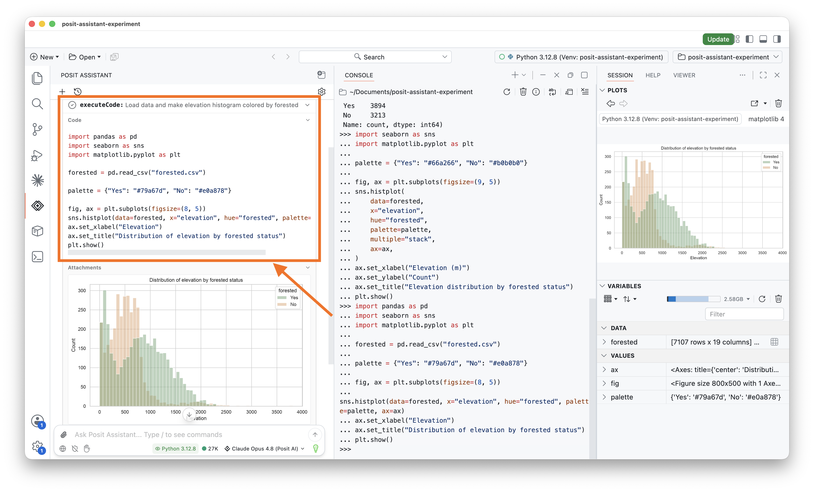{fig-align="center"}

::: notes
probably not enough for the model to write that code
show it to the user when it matters
make it easy to see and read
small things like syntax highlighting, code styling
you don't inspect every time, but if you suspect something went wrong you have the option
:::

## Shared environment

See eye-to-eye with the agent. See the same outputs, run the same code.

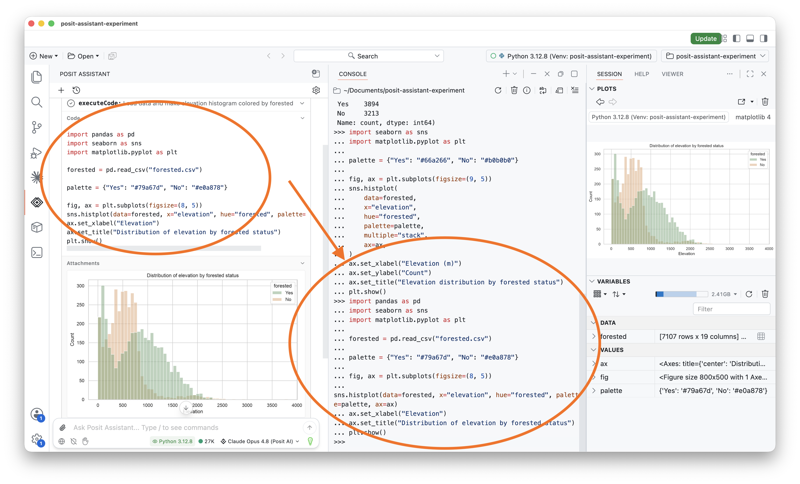{fig-align="center"}

::: notes
not only is the model writing code
writing it in a shared environment
it has access to your same r/python session
its not guessing what data you have loaded -- it can see into that data in the same way you can
you can audit its code by running it yourself
it can inspect your objects and rerun code you ran

this turns out to be very useful, especially for data analysis where you are often turning the same object around and looking at it from multiple angles and transforming it

you're seeing eye to eye with the agent, instead of the two of you occupying different worlds
:::

## {background-color="#093A3E"}

::: {style="display: flex; flex-direction: column; gap: 44px; max-width: 90%; margin: 60px auto 0 auto; color: #E8F0F6;"}

::: {.fragment}
[LLMs can fail at tasks central to data analysis.]{style="font-weight: 700; font-size: 1.4em;"}
:::

::: {.fragment}
[...but they're still useful for data analysis.]{style="font-weight: 700; font-size: 1.4em;"}
:::

::: {.fragment}
::: {style="font-size: 0.95em; margin-top: 12px; line-height: 1.5; opacity: 0.9;"}
• Make it easy for them to be right.<br>
• Make it matter less when they're wrong.
:::

:::

:::


## {background-image="figures/thankyou-bare.png" background-size="cover" background-position="center"}

::: {style="display: flex; flex-direction: column; justify-content: center; align-items: center; min-height: 70vh; gap: 40px; transform: translateY(-6vh);"}
[thank you!]{style="color: #093A3E; font-weight: 700; font-size: 2.4em;"} <span style="font-size: 2.4em; margin-left: 0.25em;"></span>

::: {style="display: flex; flex-direction: row; justify-content: center; align-items: center; gap: 80px; color: #093A3E;"}

::: {style="display: flex; flex-direction: column; align-items: flex-start; gap: 24px;"}
::: {style="display: flex; flex-direction: column; align-items: flex-start; gap: 6px;"}
[Slides]{style="font-weight: 700; font-size: 1.1em;"}

[skaltman.github.io/scipy-2026](https://skaltman.github.io/scipy-2026){style="font-size: 0.9em;"}
:::

::: {style="display: flex; flex-direction: column; align-items: flex-start; gap: 6px;"}
[bluffbench]{style="font-weight: 700; font-size: 1.1em;"}

[github.com/posit-dev/bluffbench](github.com/posit-dev/bluffbench){style="font-size: 0.9em;"}

[github.com/posit-dev/bluffbench2](github.com/posit-dev/bluffbench2){style="font-size: 0.9em;"}
:::
:::

::: {style="display: flex; flex-direction: column; align-items: flex-start; gap: 10px;"}
[AI newsletter]{style="font-weight: 700; font-size: 1.1em;"}

{width="240px"}
:::

:::
:::
